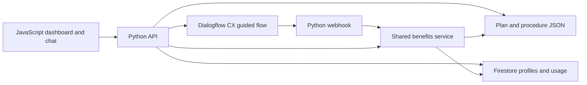

# Implementation Plan: Dental Benefits Assistant

**Branch**: `main` (feature directory: `001-dental-benefits-assistant`)
**Date**: 2026-10-03 | **Spec**: [spec.md](spec.md)
**Input**: Approved design and canonical feature specification.
**Status**: Planning complete; implementation not started at the user's request.

## Summary

Build one dashboard and guided conversation for already insured fictional
employees. Each company has one distinct plan; individual usage affects the
remaining allowance. Compare one procedure's approximate coverage, treatment
dates, and available network prices. Ask employees about recent procedures,
then record confirmed insurer-paid amounts separately from estimates.

Use Python/FastAPI for shared logic, plain JavaScript for the website, validated
JSON for policies and initial seed data, Firebase Cloud Firestore for employee
profiles and usage, and Dialogflow
CX guided flows. Research decisions are in [research.md](research.md).

## Technical Context

**Language/Version**: Python 3.12+; modern browser JavaScript ES modules.
**Primary Dependencies**: FastAPI, Pydantic, Uvicorn, python-dotenv, firebase-admin,
google-cloud-dialogflow-cx;
pytest and httpx for backend tests; Playwright for critical frontend journey
tests only. Pin resolved versions during setup.
**Storage**: Read-only validated policy/price JSON; Firebase Cloud Firestore
for employee profiles, benefit-period totals and confirmed reports. Firebase
Emulator Suite supports local development and integration tests.
**Testing**: pytest unit/API/adapter tests; browser validation of core journey,
profile changes, report confirmation, and responsive/keyboard behavior. Browser
journey tests exercise these behaviors rather than static layout snapshots.
**Target Platform**: One Python process serving a same-origin website in a
modern desktop or mobile browser. Generic live CX webhook needs reachable HTTPS.
**Project Type**: Web application with shared API and CX standard webhook.
**Performance Goals**: Complete a supported coverage journey within two minutes;
local benefit and estimate requests target one second under demo load.
**Constraints**: 18-hour implementation budget; fictional data; no real claims
processing or enrollment; no frontend/cloud credentials; no second backend.
**Scale/Scope**: A small set of company plans, employee profiles and procedure
types. Exactly one plan per company and one procedure per estimate.
**External Setup Inputs**: Incoming JSON, Google project/region/agent identifiers,
Firebase/Firestore project configuration, ADC credentials, and reachable
authenticated webhook URL. These are setup inputs,
not unspecified product behavior. No cloud resources are created by planning.

## Constitution Check

| Principle | Before research | After design |
| --- | --- | --- |
| Demo scope and simplicity | Pass: single procedure and fictional plans | Pass: deferred stretch goals are excluded |
| Shared benefit logic | Pass: Python supplies coverage values | Pass: estimate, chat, comparisons and reports share services |
| Company and employee context | Pass: one plan per company | Pass: validated references and employee-specific usage |
| Guided, understandable interaction | Pass: CX flows and dashboard | Pass: structured results, reprompts, recovery, explicit assumptions |
| Evidence before completion | Pass: TDD required during implementation | Pass: canonical test and verification tasks; live CX remains a separate gate |

No constitutional exceptions are required.

## Architecture and Interfaces



The frontend sends profile selections and chat turns to Python. Python binds a
random conversation session to the selected employee and calls CX. CX gathers
procedure and network choices; its webhook calls the shared benefits service.
Structured webhook payloads supply the same estimate to the dashboard.

Use a single backend origin for static files and API calls. Only the webhook
route requires cloud-call authentication. Employee selection represents demo
context. The user confirmed Firebase profiles and usage storage only;
sign-in is outside the first demo. Firestore server access uses backend IAM;
direct browser database access is denied. In-memory session bindings are sufficient
for this single-process demo and must expire or be recreated after restart.

The backend reads current usage on every result request. Reports are explicit,
confirmed Firestore transaction writes with a unique submission ID; retrying
a request cannot double count it. Seeding preserves existing reported totals. Chat estimation never writes reports. After recording care, the
frontend refreshes benefits and recomputes any visible estimate.

The local guided demo adapter is explicitly identified when selected. Cloud
mode failures never silently switch to local mode. Local mode supports offline
development but cannot be reported as a verified Dialogflow integration.

See [data model](data-model.md), [API contract](contracts/api.md),
[data contract](contracts/data.md), [Firebase contract](contracts/firebase.md),
and [guided flow](contracts/conversation.md).

## Project Structure

### Documentation (this feature)

```text
specs/001-dental-benefits-assistant/
  spec.md
  plan.md
  research.md
  data-model.md
  quickstart.md
  contracts/
    api.md
    data.md
    conversation.md
    firebase.md
  checklists/
    requirements.md
    demo-readiness.md
  tasks.md
  analysis.md
```

### Planned Source Code (not created during planning)

```text
backend/
  __init__.py
  app.py
  config.py
  models.py
  repository.py
  benefits.py
  comparisons.py
  usage.py
  firestore_store.py
  seed.py
  conversation.py
  dialogflow.py
  fixtures/demo.json
  tests/
    conftest.py
    test_data.py
    test_benefits.py
    test_api.py
    test_comparisons.py
    test_usage.py
    test_conversation.py
frontend/
  index.html
  styles.css
  app.js
  api.js
  tests/dashboard.spec.js
  tests/comparisons.spec.js
  tests/usage.spec.js
chat/
  README.md
  flow-blueprint.json
  agent-export/             # Future verified CX export; not fabricated
docs/
  firebase-setup.md
  dialogflow-setup.md
  json-data-mapping.md
  verification.md
README.md
requirements.txt
package.json               # Browser testing only, no frontend build pipeline
firebase.json
firestore.rules
.env.example
.gitignore
```

**Structure Decision**: Extend the existing backend, frontend, and chat folders.
Avoid a frontend build pipeline, ORM, or separate services. Disposable test data,
Firestore emulator exports, credentials, virtual environments, and bridge adapters stay out of
version control. Preserve installed Spec Kit scripts, hooks and bridge history.

## Delivery Boundaries

The first deliverable is US1: selected profile, dashboard and guided coverage
estimate. Add single-procedure timing/network comparisons (US2), then completed
usage reporting (US3). Canonical execution ordering is in [tasks.md](tasks.md).

The employer editing interface, multiple-procedure sequencing, and expiration
reminders are deferred. Incoming JSON is mapped to the documented common shape;
representative fictional fixtures can support development before it arrives.

Planning ends with cross-artifact analysis and a ready bridge handoff. Actual
implementation requires a later user instruction and must use the bridge.

## Complexity Tracking

No constitution violations. Firestore is the user-selected database for
employee profiles and usage; the CX adapter supports guided conversations.
An explicit profile selector is the current demo identity assumption.
