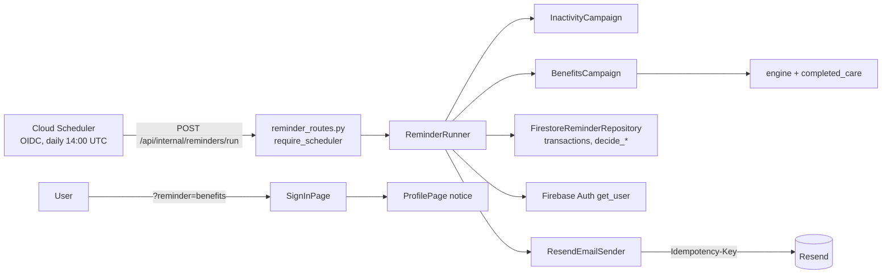

# Implementation Plan: Account Reminder Emails

**Branch**: `main` (feature directory `009-email-reminders`) | **Date**: 2026-10-04 | **Spec**: `specs/009-email-reminders/spec.md`

**Input**: Approved `docs/superpowers/specs/2026-10-04-email-reminders-design.md`.

## Summary

Port the unfinished 90-day inactivity email from `react-wip` and `stash@{0}` onto main, and add an early-October unused-benefits campaign.

- A daily Cloud Scheduler job, authenticated with OIDC, calls one internal Flask route.
- That route runs both campaigns through a shared runner, a Firestore delivery state machine and the Resend sender.
- Eligibility is rechecked inside a transaction before every send.
- The emails carry no amounts or history.
- The benefits link lands users on their profile, which shows the remaining amount from the shared calculator.

## Technical Context

**Language/Version**: Python 3.12 backend; JavaScript React 19 frontend
**Primary Dependencies**: Flask 3, firebase-admin 6.5, google-cloud-firestore 2.34, `google-auth>=2.35,<3` (new pin; already installed transitively), Resend HTTPS API through `urllib`
**Storage**: Firestore `users/{uid}` (timestamp sign-in and cycle ID) and `users/{uid}/reminder_deliveries/{campaign}-{key}`
**Testing**: pytest; pure state-machine tests plus a fake-transaction store test; Flask test-client route tests; an optional Firestore-emulator suite. Vitest for the landing and notice.
**Target Platform**: Existing Cloud Run service `dental-api` (us-central1) behind Firebase Hosting, plus Cloud Scheduler
**Constraints**:
- 60-second Cloud Run request timeout, so a 45-second run budget and at most 25 sends per campaign per run
- Resend idempotency lasts 24 hours, so finalize after 23 hours
- No amounts or history in email
**Scale/Scope**: Demo scale, tens of users; one daily run

## Constitution Check

- **I. Demo scope**: passes. Transactional reminders about fictional data; no claims, enrollment or marketing campaigns. The emails state that the data is fictional.
- **II. Shared benefit logic**: passes. Eligibility and the in-app notice use `engine.annual_max_used_cents` / `annual_max_summary` over fixture usage plus confirmed care. The email has no figures.
- **III. Company context**: passes. A backend mirror of the company-to-employee mapping, with no fallback employee; unknown companies are excluded.
- **IV. Guided interaction**: passes. The existing stale update is reused; the landing notice is plain-language.
- **V. Evidence**: TDD per task, a full-suite run, and verification recorded in `verification.md`.
- **Credentials**: the Resend key comes from Secret Manager. The local CLI refuses production Firestore by default. No key in VCS or the browser.

Post-design check: no constitutional exception is needed.

## Architecture



## Project Structure

```text
specs/009-email-reminders/         spec, plan, research, data-model, contracts/, quickstart, tasks, analysis, checklists/, verification
backend/
├── auth.py                        + verify_google_id_token, require_scheduler
├── company_employees.py           new: company → fictional employee (no default)
├── completed_care.py              + with_confirmed_usage
├── chat_routes.py                 _with_reports delegates to with_confirmed_usage
├── dental/engine.py               + unused_benefits_window
├── dental/mock_plans.py           + UNLIMITED_ANNUAL_MAX_CENTS
├── dental/models.py               UserProfile timestamp + inactivity_cycle_id, utc_datetime
├── email_delivery.py              new: templates, ResendEmailSender, LoggingEmailSender
├── reminders.py                   new: candidates, decide_* state machine, ReminderRunner
├── reminder_campaigns.py          new: InactivityCampaign, BenefitsCampaign
├── reminder_routes.py             new: POST /api/internal/reminders/run
├── run_reminders.py               new: preview / run / backfill-sign-ins CLI
├── store.py                       + record_sign_in, FirestoreReminderRepository, backfill
└── tests/                         reminder_fakes + 8 new test modules
frontend/src/
├── lib/accountNavigation.js       reminder allowlist + post-sign-in plan
├── lib/storage.js                 formatPlanDate, benefitsReminderNote
├── lib/api.js                     recordAccountCreated
├── pages/AccountPages.jsx         landing and sign-up baseline
└── pages/ProfilePages.jsx         remaining-benefits notice
```

**Structure Decision**: Reminder logic lives in small, separately testable modules: pure rules in `reminders.py`, the campaigns, and Firestore transactions in `store.py`. `main.py` only registers the blueprint and records sign-ins.

## Delivery

1. Spec artifacts, then foundations: sign-in timestamp, shared helpers, sender and scheduler auth.
2. US1 inactivity.
3. US3 benefits.
4. US2 and US4 frontend.
5. Ops tooling and docs.
6. Full verification.

Deployment (env vars, secret, Scheduler job, Resend domain) is a manual, owner-approved step described in `quickstart.md`. It starts in dry-run mode.
