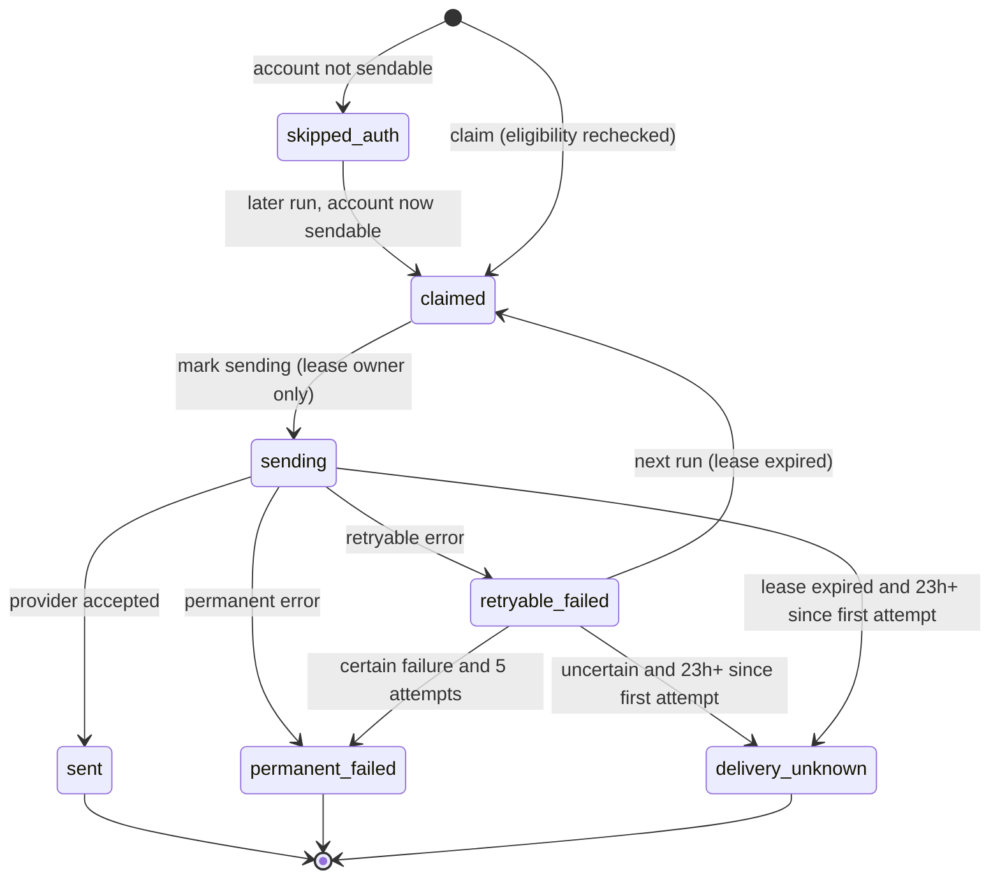

# Data Model: Account Reminder Emails

## `users/{uid}` (changed fields)

| Field | Type | Notes |
|---|---|---|
| `last_sign_in_at` | timestamp | Written as a UTC timestamp. Legacy ISO strings are still read, and `backfill-sign-ins` converts them. |
| `inactivity_cycle_id` | string (UUID4) | New on every recorded sign-in. Keys the inactivity delivery. |
| `company` | string | Existing field. Maps to a fictional employee through `company_employees.py`. |

`GET /api/me` still returns `last_sign_in_at` as an ISO-8601 string.

## `users/{uid}/reminder_deliveries/{campaign}-{key}`

Document IDs look like `inactivity-<cycle uuid>` or `benefits-2026-01-01`.

| Field | Type | Notes |
|---|---|---|
| `campaign` | `inactivity` \| `benefits` | |
| `campaign_key` | string | The cycle ID, or the plan-year start date (ISO) |
| `eligible_at` | timestamp | Last sign-in + 90 days, or the window opening |
| `status` | `skipped_auth` \| `claimed` \| `sending` \| `sent` \| `retryable_failed` \| `permanent_failed` \| `delivery_unknown` | |
| `idempotency_key` | string | `{campaign}-reminder/` + sha256(uid \0 key). Holds no raw uid or key. |
| `lease_owner` | string \| null | Job run ID |
| `lease_expires_at` | timestamp \| null | Claim time + 5 minutes |
| `attempt_count` | int | Incremented when the record moves to `sending` |
| `first_attempt_at`, `last_attempt_at`, `sent_at`, `last_checked_at` | timestamp \| null | |
| `provider_message_id` | string \| null | Resend email ID |
| `failure_code` | string \| null | Fixed set of values (see `contracts/email.md`) |
| `failure_uncertain` | bool | The provider may have accepted the email |

These records never hold email addresses, amounts, employee IDs or message bodies.

### State transitions

A skip is never written over a finished record, or over a `claimed` or `sending` record that still holds a lease.

## Benefits standing (derived, never stored)

Computed by `reminder_campaigns.benefits_standing(employee, reports, as_of, lead_months)`.

| Field | Source |
|---|---|
| `plan_year_start`, `resets_on` | `engine.plan_year_window(plan, as_of)` |
| `window_opens_on` | `engine.unused_benefits_window(plan, as_of, lead_months)` |
| `annual_maximum_cents` | The plan |
| `used_cents` | `engine.annual_max_used_cents` over fixture usage plus `completed_care.with_confirmed_usage(...)` |
| `unlimited` | `annual_maximum_cents >= mock_plans.UNLIMITED_ANNUAL_MAX_CENTS` |

A user qualifies when all of these hold:
- the plan is not unlimited
- the maximum is greater than 0
- `window_opens_on <= as_of < resets_on`
- `(max − used) × 100 >= remaining_percent × max`

## Browser session

| Key | Value | Lifetime |
|---|---|---|
| `reminder` | `"benefits"` | Set on the sign-in page from `?reminder=benefits`. Cleared after the profile notice has rendered, or on sign-out. |
